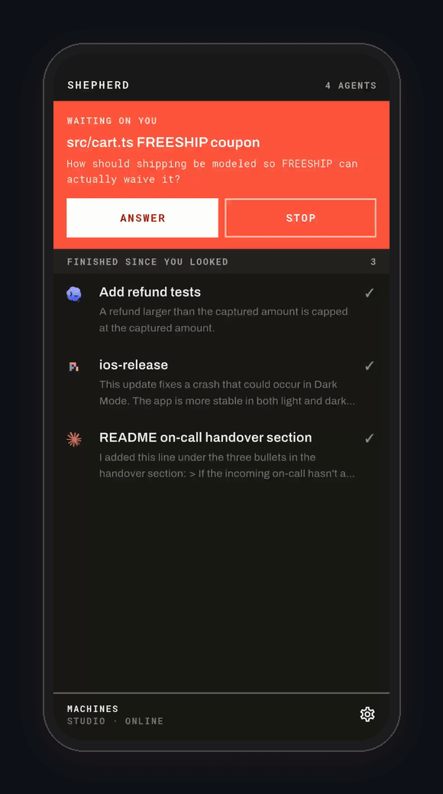
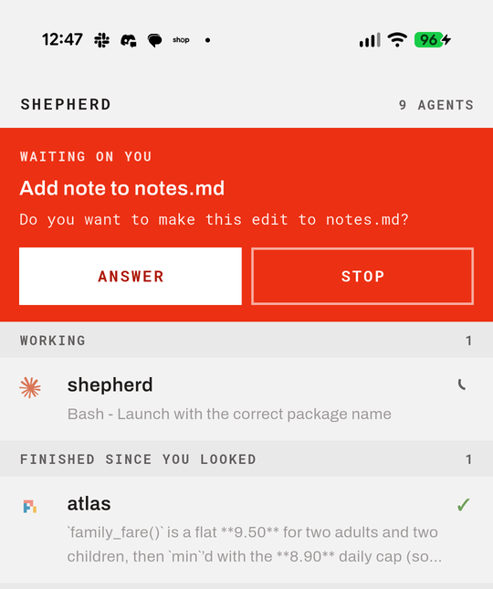
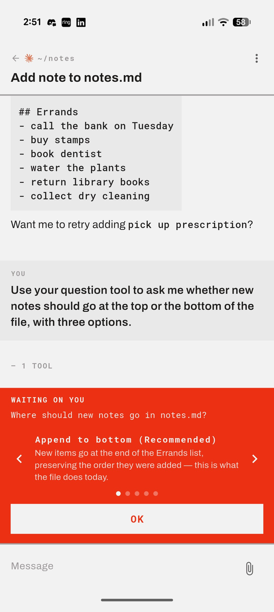
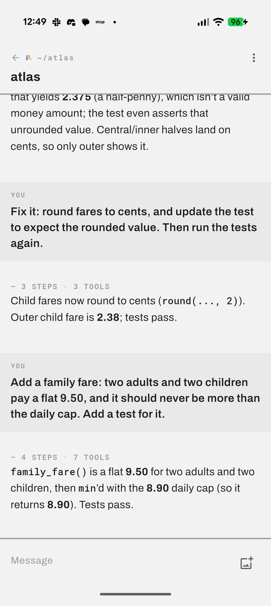
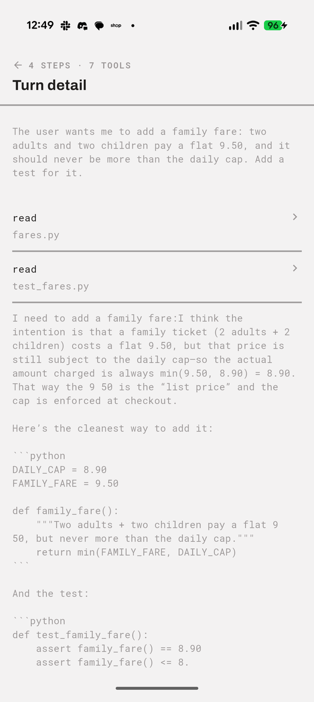
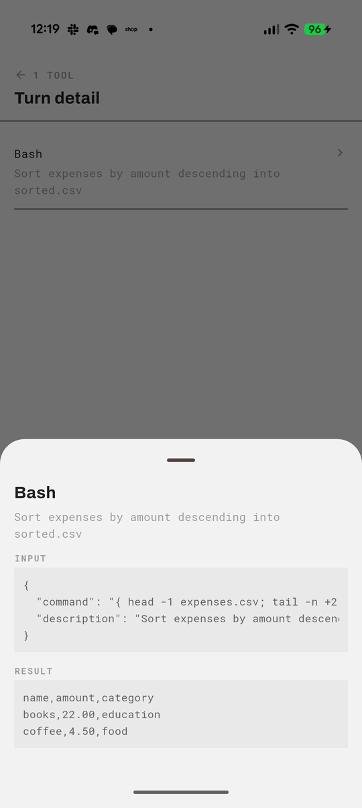
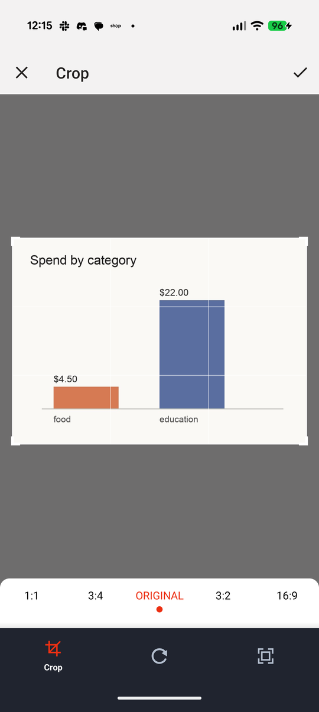
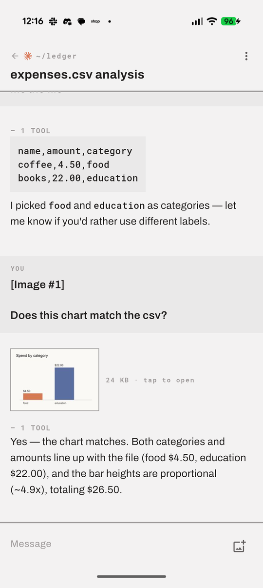
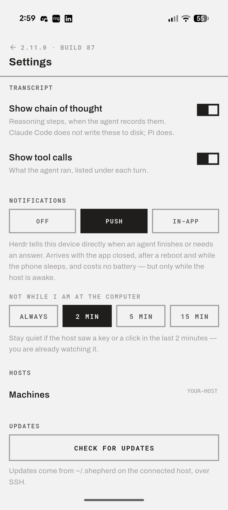

# Shepherd

**Herdr is the right way to run coding agents. A terminal is the wrong way to
read them on a phone.**

[Herdr](https://herdr.dev) keeps Claude Code, Pi, Codex and friends in panes on
your machine, where your files and your keys and your build already are. That is
where they belong. But when you are away from the desk and you want to know what
an agent decided — or it is stuck waiting on a yes — the answer is not a
terminal emulator on a 4-inch screen. Pinch-zooming an alt-screen TUI, hunting
for a cursor, sending arrow keys through a soft keyboard: that is a desktop
interface wearing a phone as a costume.

Shepherd is the other half. The agents keep running in Herdr, untouched;
Shepherd gives you a **mobile chat app** over all of them. One list of every
agent on the host, sorted by which one needs you. One conversation per agent,
built from its own transcript — not scraped off a screen. A composer at the
bottom, the way every message app on the phone works. When an agent asks a
question, you get the question and its choices as buttons.

Nothing is reproduced from the terminal. The terminal stays where it is good.

<p align="center">
  
</p>

Flutter, MIT. Tested on Android; the phone in the screenshots is a Pixel.

---

## What it does

**A question you can actually answer.** When an agent stops and asks — a
permission prompt, a choice between approaches, anything — it takes over the top
of the list with the question itself. This is the moment a terminal handles
worst on a phone, and it is the reason this app exists.



Open it and you get the answers **one at a time, in full**, with the sentence
the agent wrote underneath each one — arrows to flip, and a wide OK that sends
the keypress the menu is waiting for. Three options side by side would be three
cropped sentences, and a cropped consent button can read as a different answer
than the one it sends: "No, and tell Claude what to do differently" is not "No".



The same panel carries permission prompts — "Do you want to make this edit?" —
and open questions with no menu at all, which you answer in the composer like
any other message.

**Every agent on the host, sorted by what needs you.** Whatever is waiting comes
first, then what is working, then what finished while you were away, then the
quiet ones — each row carrying the last thing that agent actually said, not a
status word. Above: one asking, one working, one done.

**The conversation, not the terminal.** Turns come from the agent's own JSONL
transcript, so what you read is what was said — markdown, code blocks and all —
and it survives scrollback, resizes and reconnects. While an agent is working,
the row and the chat show its current step: the thought it is having, or the
tool it is running.



**The reasoning, folded away until you want it.** A turn reads as an answer,
with one grey line under it — `4 STEPS · 3 TOOLS`. Tap that for the thinking and
the tool calls in the order they happened; tap any one of them for what was sent
and what came back.

<p>
  
  
</p>

**Send it anything it can read.** The agent is never handed bytes — it is handed
a path and reads it with the tools it already has, so the useful question is not
what a phone can send but what an agent can read: a log, a CSV, a PDF, a
config, a photo. Attach picks the file, stages it in a private directory on the
host under its own name, and puts that path in the message. Photos get a crop
step on the way; nothing else does.

Coming the other way, screenshots and charts an agent produced appear in the
thread as thumbnails the host renders — a few kilobytes, not the 400 KB
original — with the full size a tap away.

<p>
  
  
</p>

**A notification when something wants you, two ways.** An agent that finishes or
gets blocked can reach the phone by **push** or by **polling**, and which one
suits you depends on whether you want to set up Firebase.

| | **Push** | **In-app** |
|---|---|---|
| How | A Herdr plugin on the host fires on `pane.agent_status_changed` and sends through Firebase | A foreground service on the phone watches the host itself, every ten seconds |
| Setup | Your own Firebase project — `google-services.json` in the app, a service account on the host | None |
| Battery | None; the phone is only woken when there is something to say | Real: the service and its connection stay up |
| Survives | The app being closed, the phone sleeping, a reboot | Neither a force-quit nor a reboot; Android also keeps a permanent notification up while it runs |
| Needs | The host awake — a sleeping laptop sends nothing | The host awake, and Android to leave the service alone |

Either way "finished" stays quiet while you are around: if you prompted an agent
on the host or used this app in the last few minutes, you do not need telling.
That window is yours — always notify, or 2, 5 or 15 minutes — and "around" is read from the
agents' own transcripts and a heartbeat this app leaves. Nothing watches your
keyboard. A question is always sent.



**Updates over the same SSH connection — no cable, no store.** `tool/publish.sh`
builds a release APK and drops it, with its build number, in `~/.shepherd/` on
the host. The phone compares that number with its own, pulls the APK over SFTP
when it is newer, and hands it to Android's installer. Nothing about it needs
`adb`, a USB cable or a Play Store listing.

That closes a loop worth spelling out: an agent running in Herdr on the host can
change Shepherd's own code, run the tests, publish a build, and the phone in
your pocket picks it up from the Settings screen. Shepherd can be worked on
*from* Shepherd, entirely remotely — you read the diff, answer its questions and
approve its edits on the phone, then install what it built.

**Ordinary phone things.** Light and dark. Renaming a session. The git branch
and dirty count for each agent's folder. More than one Herdr session on a host:
each machine can name the one it follows (`herdr --session work`), so one phone
can watch separate sets of agents.

---

## How it connects

```
  phone ──SSH──▶ host ──unix socket──▶ herdr
                  │
                  └──▶ ~/.claude/…/*.jsonl  ~/.pi/…/*.jsonl  ~/.codex/sessions/…/*.jsonl
```

One SSH connection does everything. Herdr's Unix socket is forwarded over it
(`direct-streamlocal@openssh.com`) and spoken to in newline-delimited JSON:
`session.snapshot` for the topology, `events.subscribe` for changes,
`pane.send_input` to type into a pane. Herdr also tells us where each pane's
transcript file lives, and that file — tailed over the same connection — is
where the conversation comes from. (Codex is the exception: Herdr reports no
session for it, so the app finds the newest rollout started in the pane's
directory.)

Nothing is installed on the host. The helper scripts that read transcripts are
Dart string constants inside the APK, sent down the channel as heredocs on
each call, so the code that runs is always the code the installed build carries.

Your host needs: `sshd`, Herdr 0.9+, and Python 3. Pillow or `sips` if you want
thumbnails; without either, pictures still open on demand.

---

## Running it

```bash
flutter run   # Flutter 3.47
```

Then add a machine: host, user, key or password, and the Herdr session if it is
not the default one. The app can generate a key and show the line to put in
`authorized_keys`. From an Android emulator the host machine is `10.0.2.2`.

To skip the form during development, pass the config at build time:

```bash
flutter run --dart-define-from-file=dev_config.json
```

with `SHEPHERD_HOST`, `SHEPHERD_USER` and `SHEPHERD_KEY_B64` (base64 of a
private key). Saved settings always win over these. Keep that
file out of the repo — it holds a private key.

Push notifications need your own Firebase project: drop its
`android/app/google-services.json` in place and link the plugin in
[`plugin/herdr-push/`](plugin/herdr-push/README.md) into Herdr. Without it,
in-app notifications work on their own.

There is also a headless check of the whole transport, useful when something
breaks and you want to know whether it is Flutter or the protocol:

```bash
dart run tool/e2e_check.dart <host> <user> <key-path> <socket-path>
```

Testing on a real phone against a real host is described in
[docs/test-matrix.md](docs/test-matrix.md).

---

## What it does not do

- **No terminal.** Herdr sizes panes to whatever client attaches, so a PTY on a
  phone would reshape the session on your desktop.
- **No terminal control beyond answering.** A question with numbered choices is
  answerable, and so is anything that takes prose. Driving a TUI — cycling
  modes, scrolling a pager, anything that wants a specific key — is not.
- **Three agents read properly.** Claude Code, Pi and Codex each have their own
  parser, verified against real sessions, pictures included. Anything else
  Herdr reports is read with the Claude-shaped one, which tolerates more than it
  should but was not written for it.
- **Codex's thinking stays sealed.** Codex encrypts its reasoning on disk, so the
  steps behind a Codex turn are its tool calls only. Claude Code does not write
  its thinking at all; Pi does, and shows it.
- **Untested outside Android.** It is a Flutter app, and little in it is
  platform-specific beyond the packaging and the notification plumbing — but
  iOS has never been built or run.

## Licence

MIT — see [LICENSE](LICENSE).
